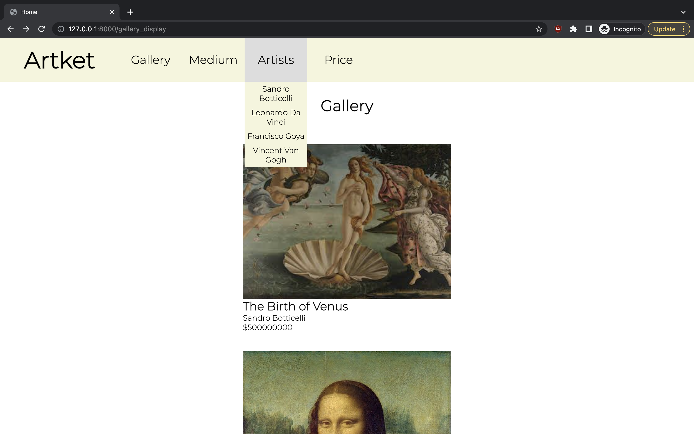

# Artket: Ebay for artwork

## Project Description

Artket was created to provide an alternative to big market entities such as
Sotheby auction houses which take large commission cuts from both the buyers
and
sellers of art. By providing a virtual marketplace to address these demands for
luxury objects, the service fees for handling these items can be significantly
undercut. This benefits both sellers and buyers of art as they do not need to
concern themselves with high commission fees or the physical limiations (e.g.
location) of a physical auction.

On a very high level, the core functionalities of the application include
allowing the users to view items of value online, filter said items by price,
artist, or medium, view detailed information (e.g. date and location of
creation
and price), and purchase the artwork.

## Developer Bios

Yong Seok (Tommy) Lee

- CS Major
- Senior at the College of Wooster
- Still waiting for the NieR:Automata anime

Duc Minh Dao

- CS and Math Major
- Senior at the College of Wooster
- Would do unspeakable deeds to be able to work at Google

## Setup

The project was developed and tested with `python3.9.5`. However, any version
of
`python` after `3.8` (need f-string) should be sufficient. An exception to this
is when the server and client code is run on ARM architecture family (like M1
chip), then require `python` version larger or equal to `3.9.1`. `python3.9` is
required due to `3.9.1` is the first version of `python` that support ARM
architecture.

We suggest the developer running this project with a virtual environment using
`python>=3.9.1`. The project also require the modules listed bellow to be
installed in the environment, this list of module can also be found at
`root/requirements.txt`. Required modules are:

* `aniso8601==9.0.1`
* `certifi==2022.12.7`
* `charset-normalizer==2.1.1`
* `click==8.1.3`
* `Flask==2.2.2`
* `Flask-RESTful==0.3.9`
* `Flask-SQLAlchemy==3.0.2`
* `idna==3.4`
* `importlib-metadata==5.1.0`
* `itsdangerous==2.1.2`
* `Jinja2==3.1.2`
* `MarkupSafe==2.1.1`
* `phonenumbers==8.13.2`
* `Pillow==9.3.0`
* `pytz==2022.6`
* `requests==2.28.1`
* `six==1.16.0`
* `SQLAlchemy==1.4.44`
* `urllib3==1.26.13`
* `Werkzeug==2.2.2`
* `zipp==3.11.0`

## Build & Run

Once all the requirements are satisfied and the setup is done correctly as
mentioned from the Setup section, the developer can build and run the project.
It should be noted that the Artket project is separated into 2 main components
-- the server program (source code is in the backend directory) and the client
program (source code is in the frontend directory).

The server program can be run independently, while the client program requires
the server program to be running at `http://127.0.0.1:5000` (which is defined
with variable `BASE` in `root/frontend/client_app.py`). More on implementation
detail in the Code Structure section.

To run the server and client program, the developer must change their current
working directory to the root directory for this project, namely
`microgoo-final-project`. Once in the directory, the developer can run the
server program and the client program with the environment setup from the Setup
section as follows:

* The server program: `python backend/server_app.py`
* The client program: `python frontend/client_app.py`

If done correctly, the developer can use the app by going to
`http://127.0.0.1:8000`.

### Notes for Tester

* When run the `server_app.py` script, it will check if the sqlite3 database
  exists. If the database exists, then it will just run the script with that
  database. On the other hand, if the database does not exist, then the script
  will generate a new sqlite3 database in `root/backend/instance` directory
  with some dummy data for testing. The dummy data is generated using the code
  in `root/backend/db_generator.py` script, and all data are the same for each
  generation except the invitation code.
* To test the register functionality, please use the following invitation code:
  `dev_default_invite_code_{i}` where the value of `{i}` is 0 to 10. Keep in
  mind that each invitation code will be removed when a new account is created
  with it.
* To test the purchase functionality, please use a valid credit card to try to
  make the purchase. The program use a luhn checksum to check for credit card
  number, so the card must be valid but can be expired. For testing purpose, we
  suggest using the following card number `3716820019271998` with the CVV code
  is any 3 digits number.

> Do NOT read this the remaining of this subsection if the tester wants to
> experience the app like a targeted user

* The Artket website store login info is based on browser session. When the
  user
  goes to `http://127.0.0.1:8000`, they are either redirected to the login page
  (if they have not logged in yet) or the homepage (if they have logged in).
  Closing a browser tab alone will not remove the session, which allows the
  user
  to revisit the site without the need to login again. On the other hand, if
  all
  active windows of the browser or the entire browser application is closed,
  this will remove the browser session and require the user to log in again.

* The Artket website uses a sqlitte3 database to store information about the
  artwork, registered user, and available invitation code. Therefore, new user
  accounts and purchasing artwork will update the database and thus allow to
  keep these information across Artket application session.

## Code Structure

The project is divided into 2 main parts, the server side code (stored in
backend directory) and the client side code (stored in frontend directory)

### Server Side

The server of Arket is designed to run independently from the client side.

The server is responsible for handling all query to the database from the
client
side. The server performs some query validation to make sure all required
information are available and have the correct data type. The server then
performs data formatting before committing them to the database.

For each query, the server will respond with a dictionary and a status code. If
the status code is not 200, then the response is a dict with the following form
`{"error_msg: {(str) some error message}}`. If the status code is 200, that
means the query performed successfully. In this case, the response is a dict
that contains all the information that the client requested in that query.

The server code starts from `root/backend/server_app.py`, where it configures
the server flask app, the database, dummy data for testing, and the endpoint
for
each server functionality. Note that each of the server functionalities have
their own `.py` file. Additionally, all the server data, such as the sqlitte3
database, history.json, and the picture of the artwork (in base64 text), are
stored in the `root/backend/instance` directory.

### Client Side

The client of Artket requires the server to run on `http://127.0.0.1:5000` for
it to work.

The client side handles all query from the browser, tries to transform those
received data to the correct data type, and creates a corresponding query to
the
server side.

Once the query goes through, the server will respond back with some data. Then,
the client side will then check the status code of the response and parse the
response accordingly.

The client side endpoint and logic are in `root/frontend/client_app.py`. These
functions will pass data to the jinja2 templates store in
`root/frontend/templates` directory. The Artket website uses some static image
and icon, which are stored in `root/frontend/static` directory.

## Using the Application

This section will assume that the user is using the website for the first time
(i.e. the user does not have an account)

1. When opening the application, the user is taken to the login page. The user
   can choose to register, or log in if they have previously made an account

Login page:  

2. After pressing register, the user is taken to the register page. From there,
   they can fill out the credentials. Once the account has been created, the
   user is redirected to the login page

Register page:  

3. After loggin in, they are taken to the home page. From the home page, they
   can press the "Gallery" button in the navigation bar to be redirected to the
   gallery of paintings

Home page:  

Gallery page:  

4. From the gallery, the user can scroll down to see a list of paintings, or
   use
   the filter to look for paintings with specific mediums, artists, or price
   range

Artist filter:  

Medium filter:  

Price filter:  

5. Once a filter has been selected, it will be displayed in the page

Selecting Leonardo Da Vinci for filter displays all paintings made by Da Vinci:
 

6. The user can click on any of the paintings to see more information about
   them. Additionally, this page contains the button that redirects the user to
   the purchase page, should the user decide to purchase the artwork

 

7. Once the user presses the purchase button, they are redirected to the
   purchase page, where they are expected to fill out their credit/debit card
   credentials. Once they fill out the information, the user is redirected to
   another page indicating that the purchase has been successful. They can then
   press the "Back to Gallery" button to be redirected to the gallery.

Purchase page:  

Purchase successful page:  

