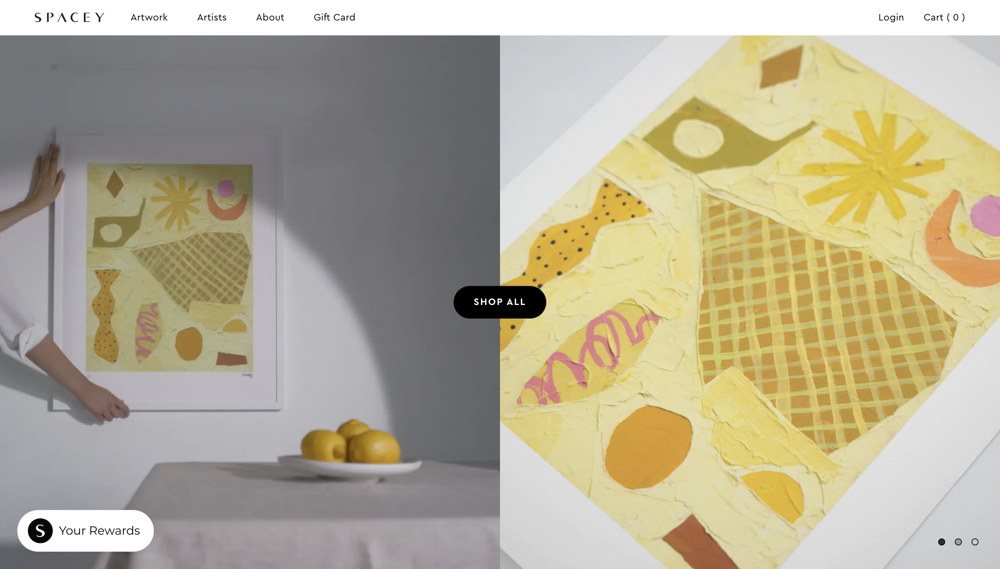
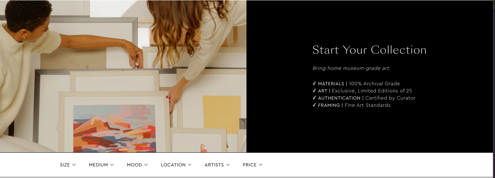
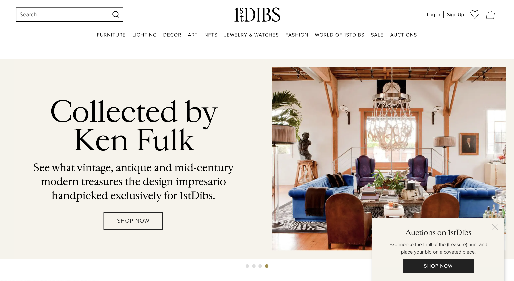
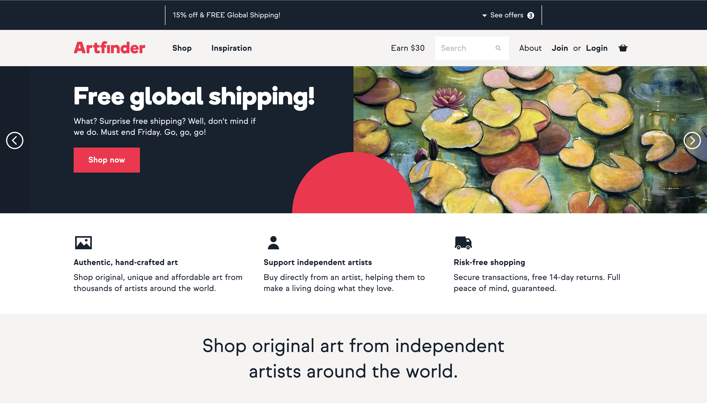
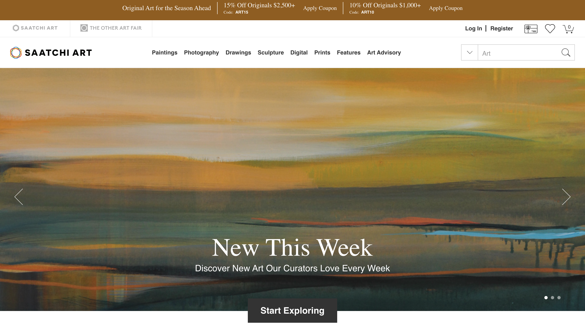
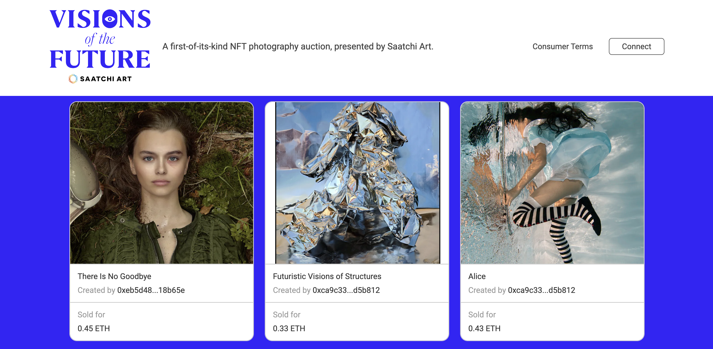

# Domain Research

Links:
- https://www.1stdibs.com/collections/fall-catalogue/
- https://spaceystudios.com/
- https://www.artfinder.com
- https://www.saatchiart.com/
- https://society6.com/

## What is "good" about current approaches?

- Minimalistic and eye catching design that prompts the user to click and explore the different artworks 

- Grouping only the most commonly used filters together to avoid overwhelming the users with information 

## What could use improvements?
- Pop ups are distracting and hinder the user towards their goals. They could be entirely removed

- Supplementary information that blocks the user from their main goal. One major theme regarding thisi s shipping, where "Free global shipping!" takes away much of the screen 

- Sudden shift from muted colors to use of bright, flashy colors hurts eyes and detracts from the more minimalistic and calm mood that art websites usually have. For instance, from 
 to 
